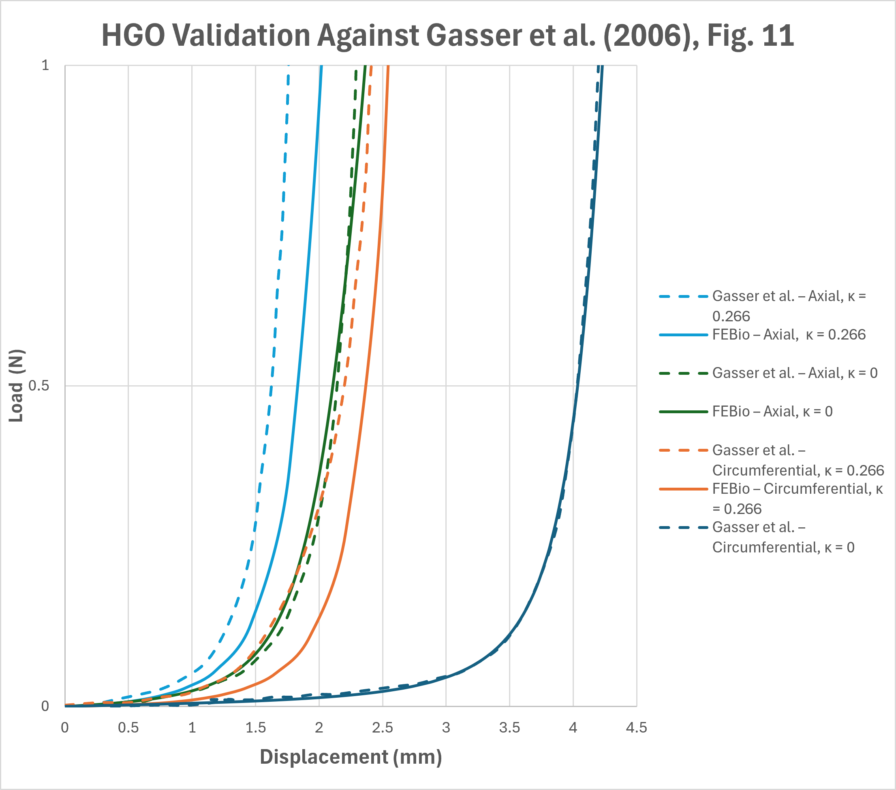
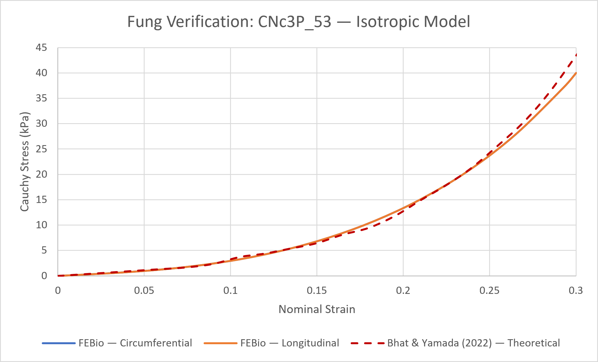
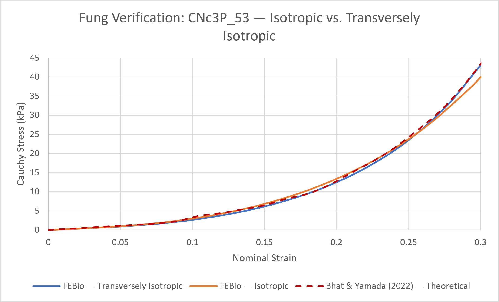
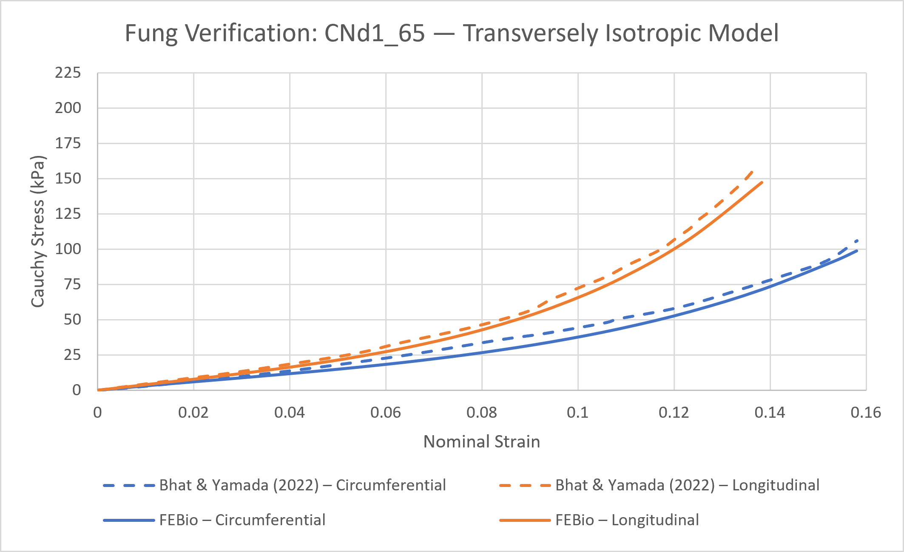
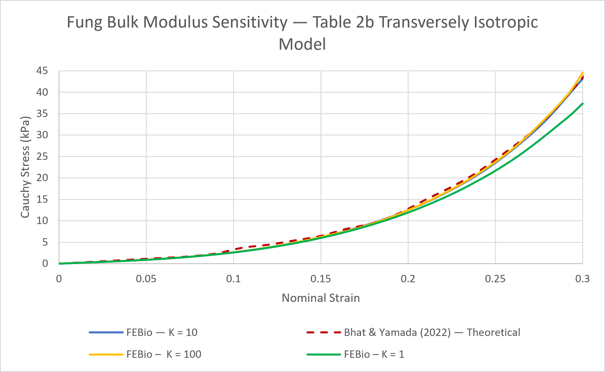

# Material Model Verification

This document describes the verification procedures used to evaluate the constitutive material models implemented in this repository. Each section identifies the reference data used for verification, describes the corresponding FEBio model configuration, and outlines relevant assumptions and limitations.

Detailed verification focused on the Holzapfel-Gasser-Ogden (HGO) and Fung orthotropic material models through comparison of the generated FEBio responses with published arterial tissue results. The Neo-Hookean implementation was evaluated through preliminary model checks, as described below.

The following material models are currently implemented:

- Neo-Hookean
- Holzapfel-Gasser-Ogden (HGO)
- Fung orthotropic

## Neo-Hookean Material Model

The Neo-Hookean material model is currently included as a material option within the model-generation workflow. A separate verification case using published experimental data was not developed for this material model. Instead, the verification work for this repository focused on the HGO and Fung material models, for which published arterial tissue results were available for comparison and which are more commonly used to represent the nonlinear and anisotropic mechanical behaviour of arterial tissue in cardiovascular biomechanics. 

The Neo-Hookean implementation was considered sufficiently verified through preliminary checks of the generated material definition and model response. As a comparatively simple isotropic material formulation, the Neo-Hookean model does not capture several features of arterial tissue behaviour represented by the HGO and Fung formulations. More extensive published data verification was therefore prioritized for these models. 

## Holzapfel-Gasser-Ogden (HGO) Material Model

### Verification Reference

The Holzapfel-Gasser-Ogden implementation was evaluated using results reported by Gasser et al. (2006):

Gasser, T. C., Ogden, R. W., & Holzapfel, G. A. (2006). Hyperelastic modelling of arterial layers with distributed collagen fibre orientations. *Journal of the Royal Society Interface*, 3(6), 15–35.

The publication is not included in this repository. Users should consult the original publication for complete material-model formulation, experimental methodology, and reference results.

The verification focused on reproducing the force-displacement relationships presented in Figure 11 of the publication. Four cases were considered:

- Circumferential specimen, $\kappa = 0$
- Circumferential specimen, $\kappa = 0.266$
- Axial specimen, $\kappa = 0$
- Axial specimen, $\kappa = 0.266$

The published curves were digitized to allow direct comparison with the reaction forces obtained from FEBio.

### Verification Model

A rectangular, single-layer specimen was generated using the same Python-based workflow provided in this repository. The Holzapfel-Gasser-Ogden material parameters reported by Gasser et al. (2006) were assigned to the specimen. The specimen geometry and loading conditions were selected to reproduce the configuration reported by Gasser et al. (2006), while the mesh density was selected for the FEBio verification model.

- Length (x): 10.0 mm
- Width (y): 3.0 mm
- Thickness (z): 0.5 mm
- Nodes in x: 41
- Nodes in y: 21
- Nodes in z: 5
- Loading type: uniaxial
- Loading mode: grip-constrained
- Prescribed displacement: 4.3 mm in the x-direction

The specimen's left face was constrained in all three directions, while the right face was constrained in the y- and z-directions and prescribed a displacement of 4.3 mm in the x-direction. The same loading configuration was used for all four verification cases; the circumferential and axial specimens were represented by changing the local material reference direction.

The local material reference direction was adjusted according to specimen orientation and the material axis definitions reported in the paper. For the structured Hex8 mesh generated by this repository:

- **Circumferential specimen:** local material axis = 1,2,4
- **Axial/longitudinal specimen:** local material axis = 2,3,1

These orientations are available through the `reference_direction` user-configurable setting in `main.py`:

- `"x"` corresponds to local axis 1,2,4 (circumferential)
- `"y"` corresponds to local axis 2,3,1 (axial/longitudinal)

The fiber-family angle, $\gamma$, is defined relative to this local material reference direction according to the [FEBio Feature Manual](https://febiosoftware.github.io/febio-feature-manual/features/core_mat3dvaluator_local/).

### FEBio Solution Settings

Initial simulations using the original/default generator settings did not reproduce the reference FEBio result and, at larger prescribed displacements, could experience convergence failure.

FEBio solution settings were changed one at a time to determine which settings affected the force-displacement response and which were necessary for the simulation to converge.

These solution settings can be changed in the **Steps** section of the *Model* menu in FEBio Studio. Based on these tests, the following analysis settings were selected for the final generator because they allowed the simulations to converge over the complete loading range:

- **Time stepping**
  - Number of time steps = 100
  - Step size = 0.01

- **Automatic time stepper (`time_stepper`)**
  - Type: default
  - Maximum retries = 25
  - Optimal iterations = 11
  - Maximum time-step size = 0.1
  - Aggressiveness = -2
  - Cutback factor = 0.5

- **Quasi-Newton method (`qn_method`)**
  - BFGS

Full Newton was also investigated as an alternative solution method, but was not required to reproduce the reference result; BFGS produced an equivalent response.

The automatic time stepper was particularly important. Simulations using 20 time steps with a step size of 0.05 resulted in error termination before reaching the full prescribed displacement.

These settings are written automatically to the FEBio input files generated using this repository. They are documented here because several are less apparent to users inspecting or modifying the model through FEBio Studio.

### Bulk Modulus

The bulk modulus presented a separate limitation in reproducing the published results. A bulk modulus was required by the FEBio HGO implementation but was not reported for the Figure 11 simulations in Gasser et al. (2006).

Consequently, the bulk modulus was treated as an assumed/fitted parameter during verification rather than as a parameter obtained directly from the publication.

Sensitivity tests were performed by varying the bulk modulus and comparing the resulting FEBio force-displacement curves with the digitized Figure 11 data. The bulk modulus was adjusted separately for each of the four cases to determine which value produced the closest agreement with the digitized curve.

The goal of this procedure was not to identify a physical bulk modulus for the arterial tissue. The bulk modulus was adjusted only to determine how closely the FEBio model could reproduce the published curves when this parameter was not provided in the paper.

The cases without fiber dispersion ($\kappa = 0$) showed close agreement with the digitized reference curves. Larger discrepancies remained for the cases with fiber dispersion ($\kappa = 0.266$), with the axial specimen showing the largest discrepancy. Increasing the bulk modulus shifted the axial response toward the published curve, but the model became progressively less sensitive to further increases in bulk modulus.

The following bulk moduli were identified as providing the closest agreement for each specimen:

- **Circumferential specimen ($\kappa = 0$):** $K = 65$ MPa
- **Circumferential specimen ($\kappa = 0.266$):** $K = 65$ MPa
- **Axial specimen ($\kappa = 0$):** $K = 10$ MPa
- **Axial specimen ($\kappa = 0.266$):** $K = 35$ MPa

### Comparison with Published Results




*Figure 1. Comparison of FEBio-generated force-displacement curves (solid lines) with data digitized from Figure 11 of Gasser et al. (2006) (dashed lines). Reference data digitized from Gasser et al. (2006), Figure 11.*


The final FEBio force-displacement curves were compared with the digitized curves from Figure 11 of Gasser et al. (2006).

Close agreement was obtained for both cases without fiber dispersion ($\kappa = 0$). The cases with fiber dispersion ($\kappa = 0.266$) showed greater discrepancies between the FEBio and digitized reference curves, with the largest discrepancy occurring for the axial specimen. These discrepancies remained despite the bulk-modulus adjustments described above.

### Conclusions & Limitations

The verification demonstrates that the HGO implementation generated by this repository can reproduce the general nonlinear force-displacement behaviour reported by Gasser et al. (2006). Close agreement was obtained for both cases without fiber dispersion ($\kappa = 0$). The cases with fiber dispersion ($\kappa = 0.266$) showed greater discrepancies between the FEBio and digitized reference curves, with the largest discrepancy occurring for the axial specimen. These discrepancies remained despite the bulk-modulus adjustments described above.

The following limitations should be considered when interpreting the results:

- The Figure 11 data were obtained by digitizing the published figure rather than from the original numerical dataset.
- The bulk modulus required by the FEBio implementation was not reported in the reference publication and therefore had to be investigated separately.
- Different bulk modulus values were used to improve agreement between individual FEBio simulations and the published curves.
- The cases with fiber dispersion ($\kappa = 0.266$) retained discrepancies that could not be eliminated through bulk modulus adjustment alone, with the largest discrepancy occurring for the axial specimen.

Overall, the verification process shows that the implemented HGO workflow reproduces the expected nonlinear material behaviour and the general trends reported by Gasser et al. (2006), although it does not exactly reproduce all four published curves.

## Fung Material Model

### Verification Reference

The Fung material model implementation was evaluated using experimental data and material parameters reported by Bhat & Yamada (2022):

Bhat, S. K. & Yamada, H. (2022). Mechanical characterization of dissected and dilated human ascending aorta using Fung-type hyperelastic models with pre-identified initial tangent moduli for low-stress distensibility. *Journal of the Mechanical Behavior of Biomedical Materials*, 125, 104959.

The publication is not included in this repository. Users should consult the original publication for the complete material-model formulation, experimental methodology, and reference results.

This verification focused on reproducing the equibiaxial stress-strain behaviour reported in the publication. Three material configurations were considered:

- Isotropic model: specimen CNc3P_53, Table 2a
- Transversely isotropic model (isotropic in the $x_1-x_2$ plane): specimen CNc3P_53, Table 2b
- Transversely isotropic model (isotropic in the $x_2-x_3$ plane): specimen CNd1_65, Table 2e

The CNc3P_53 specimen was first used to compare the isotropic model with the transversely isotropic model that is isotropic in the $x_1-x_2$ plane. The same theoretical response reported by Bhat & Yamada (2022) was used as the reference for both cases.

The CNd1_65 specimen was then used to evaluate a second transversely isotropic configuration, in which the circumferential direction ($x_1$) represents the anisotropic direction and the longitudinal-radial ($x_2-x_3$) plane is isotropic. For this case, the FEBio response was compared with the experimental data reported in the publication.

Reference stress-strain curves were digitized from the figures provided in the publication to allow direct comparison with the Cauchy stresses obtained from FEBio.

### Verification Model

Rectangular, single-layer specimens were generated using the same Python-based workflow provided in this repository. The Fung material parameters reported by Bhat & Yamada (2022) were assigned to the specimens. The specimen dimensions and prescribed displacements were selected to reproduce the equibiaxial strain ranges used for the verification comparisons. The specimen thickness and mesh density were not reported in the publication and were therefore selected for the FEBio verification models.

For the CNc3P_53 specimen used for the isotropic and $x_1-x_2$ transversely isotropic cases:

- Length (x): 15.0 mm
- Width (y): 15.0 mm
- Thickness (z): 0.5 mm
- Nodes in x: 21
- Nodes in y: 21
- Nodes in z: 5
- Loading type: biaxial
- Loading mode: symmetric gauge
- Prescribed displacement: 2.25 mm per side in the x- and y-directions

For the CNd1_65 specimen used for the $x_2-x_3$ transversely isotropic case:

- Length (x): 18.0 mm
- Width (y): 18.0 mm
- Thickness (z): 0.5 mm
- Nodes in x: 21
- Nodes in y: 21
- Nodes in z: 5
- Loading type: biaxial
- Loading mode: symmetric gauge
- Prescribed displacement: 1.422 mm per side in the x- and y-directions

Symmetric equibiaxial loading was applied in the circumferential (x) and longitudinal (y) directions. Opposing specimen faces were prescribed equal displacements in opposite directions, such that the prescribed displacement represented half of the total specimen extension. Nominal strain was calculated according to:

**Nominal strain = total change in length / initial specimen length**

The local material axes were defined according to the coordinate directions used by Bhat & Yamada (2022), where $x_1$, $x_2$, and $x_3$ represent the circumferential, longitudinal, and radial directions, respectively. For the structured Hex8 mesh generated by this repository, the local material-axis definition was set to `1,2,4`, corresponding to:

- **Local $x_1$:** circumferential/global x-direction
- **Local $x_2$:** longitudinal/global y-direction
- **Local $x_3$:** radial/global z-direction

This material-axis definition was maintained for all three verification cases so that the material symmetry specified by the published Fung parameters corresponded to the appropriate anatomical directions.

### Material Parameter Conversion

The verification models used the **Fung orthotropic** material formulation implemented in FEBio. The Fung material parameters reported by Bhat & Yamada (2022) could not be entered directly into the FEBio Fung orthotropic material model because the two formulations express the coefficients of the exponential term using different parameter sets. Bhat & Yamada (2022) report the material constants $a$, $a_{ii}$, and $k_{ij}$,  whereas the FEBio implementation requires the elastic
moduli $E_i$, Poisson's ratios $\nu_{ij}$, shear moduli $G_{ij}$,
and a scaling coefficient $c$. The parameters reported in Table 2 of Bhat & Yamada (2022) were therefore converted to the inputs required by FEBio.

Bhat & Yamada (2022) provide relationships between the material parameters $k_{ij}$ and the coefficients of the exponential term in Equation 18. These relationships were rearranged to obtain the coefficients required for the parameter conversion:

$$
a_{ij} = k_{ij}\sqrt{a_{ii}a_{jj}}
$$

The coefficients of the exponential term in the strain-energy function were then matched to the corresponding coefficients in the FEBio Fung orthotropic formulation. For the normal strain terms, a stiffness matrix was constructed from the published Fung coefficients:

```math
\mathbf{C} =
2a
\begin{bmatrix}
a_{11} & a_{12} & a_{31} \\
a_{12} & a_{22} & a_{23} \\
a_{31} & a_{23} & a_{33}
\end{bmatrix}
```


where the material constant $a$, reported in kPa by Bhat & Yamada (2022), was converted to MPa for consistency with the unit system used in the FEBio verification models.

The corresponding compliance matrix was calculated by inverting the stiffness matrix:

$$
\mathbf{S} = \mathbf{C}^{-1}
$$

The elastic moduli required by FEBio were then obtained from the diagonal terms of the compliance matrix:

$$
E_1 = \frac{1}{S_{11}}, \qquad
E_2 = \frac{1}{S_{22}}, \qquad
E_3 = \frac{1}{S_{33}}
$$

The Poisson's ratios were calculated from the appropriate off-diagonal terms of the compliance matrix according to:

$$
\nu_{12} = -E_1S_{12}, \qquad
\nu_{23} = -E_2S_{23}, \qquad
\nu_{31} = -E_3S_{31}
$$

The resulting FEBio-compatible parameters are summarized below.

The complete parameter-conversion calculations for all three verification cases, including the stiffness and compliance matrices and the calculation of the corresponding engineering constants, are provided in [`FUNG_PARAMETER_CONVERSION.xlsx`](FUNG_PARAMETER_CONVERSION.xlsx) in the `documents/` directory.

**Table 1. FEBio parameters used for the Fung material model verification cases.**

| Parameter | Table 2a – CNc3P_53 | Table 2b – CNc3P_53 | Table 2e – CNd1_65 |
| --- | ---: | ---: | ---: |
| E1 (MPa) | 0.00869 | 0.02506 | 0.00711 |
| E2 (MPa) | 0.00869 | 0.02506 | 0.17431 |
| E3 (MPa) | 0.00869 | 0.00875 | 0.17431 |
| ν12 | 0.47562 | -0.59452 | 0 |
| ν23 | 0.47562 | 1.39899 | 0.271 |
| ν31 | 0.47562 | 0.48854 | 0 |
| G12 (MPa) | 0.00290 | 0.00292 | 0.005* |
| G23 (MPa) | 0.00290 | 0.005* | 0.06857 |
| G31 (MPa) | 0.00290 | 0.005* | 0.005* |
| c (MPa) | 0.04192 | 0.02004 | 0.00658 |
| K (MPa) | 10 | 10 | 10 |

\* Assigned values.

FEBio requires all three shear moduli to be defined, although they do not directly contribute to the normal stress response under the equibiaxial loading used for this verification. The shear moduli for the isotropic case and for the isotropic plane of each transversely isotropic case could be calculated from the reported material parameters. The remaining shear moduli could not be uniquely determined from the published data and were therefore assigned the values marked with asterisks in Table 1. Equal values were assigned where required to maintain transverse isotropy.

A bulk modulus of 10 MPa was used for all three verification cases. The bulk modulus was not reported by Bhat & Yamada (2022) and was therefore treated as an assumed parameter.

This conversion allowed the Fung parameters reported by Bhat & Yamada (2022) to be represented using the material constants required by the FEBio Fung orthotropic formulation.

### FEBio Solution Settings

The following FEBio solution settings were used for all three Fung material model verification cases:

- **Time stepping**
  - Number of time steps: 100
  - Step size: 0.01
- **Automatic time stepper (`time_stepper`)**
  - Type: default
  - Maximum retries: 25
  - Optimal iterations: 11
  - Maximum time-step size: 0.1
  - Aggressiveness: -2
  - Cutback factor: 0.5
- **Quasi-Newton method (`qn_method`)**
  - BFGS

These settings allowed all three Fung verification simulations to converge over the complete prescribed loading range. No additional changes to the solution settings were required for either the isotropic or transversely isotropic verification cases.

### Comparison with Published Results

The FEBio-generated stress-strain responses were compared with theoretical and experimental data digitized from Bhat & Yamada’s (2022) Figure 7. Comparisons were performed for the isotropic and two transversely isotropic material configurations described above.

For the isotropic verification, the FEBio response generated using the material parameters derived from Table 2a for specimen CNc3P_53 was compared with the corresponding theoretical stress-strain data.



*Figure 2. Comparison of the FEBio-generated circumferential and longitudinal stress-strain responses for the isotropic Fung material model with the theoretical data digitized from Bhat & Yamada (2022), specimen CNc3P_53 (Table 2a).*

The isotropic material model produced equivalent circumferential and longitudinal stress responses, as expected from the assumed material symmetry. Close agreement was observed between the FEBio-generated and digitized responses throughout the investigated strain range. Minor differences were observed at higher strains, with the FEBio response slightly underpredicting the digitized response near the maximum applied strain.

The same CNc3P_53 theoretical response was subsequently compared with the transversely isotropic material parameters reported in Table 2b. In this case, the material was defined as isotropic in the circumferential-longitudinal ($x_1-x_2$) plane.



*Figure 3. Comparison of FEBio-generated stress-strain curves for the isotropic and $x_1-x_2$ transversely isotropic Fung material models with theoretical data for specimen CNc3P_53 digitized from Bhat & Yamada (2022).*

The transversely isotropic FEBio response provided closer agreement with the theoretical response than the isotropic model. This reproduces the trend reported by Bhat & Yamada (2022), who found a lower curve-fitting error for the transversely isotropic formulation than for the isotropic formulation for this specimen.

A second transversely isotropic configuration was evaluated using specimen CNd1_65 and the material parameters reported in Table 2e. In this configuration, the longitudinal-radial ($x_2-x_3$) plane is isotropic, and the circumferential ($x_1$) direction represents the unique anisotropic direction.



*Figure 4. Comparison of FEBio-generated circumferential and longitudinal stress-strain curves with experimental data for specimen CNd1_65 digitized from Bhat & Yamada (2022), using the Table 2e transversely isotropic material parameters.*

The FEBio model reproduced the directional behaviour observed experimentally, with the longitudinal stress exceeding the circumferential stress under equibiaxial loading. Close agreement was observed between the FEBio and experimental responses over the investigated strain range; however, the FEBio consistently underpredicted the experimental stress response.

Unlike the CNc3P_53 comparison, Bhat & Yamada (2022) did not provide the corresponding fitted theoretical stress-strain curves for the Table 2e CNd1_65 case. The FEBio response therefore could not be compared directly with the authors' theoretical model response and was instead compared with the experimental data used for material characterization.

### Parameter Sensitivity

Because the bulk modulus and selected shear moduli required by the FEBio Fung orthotropic formulation were not available from the published parameter sets, additional sensitivity tests were performed to evaluate whether these assumed values influenced the predicted stress-strain response.

The bulk modulus required by the FEBio Fung orthotropic material formulation was not reported by Bhat & Yamada (2022), and a value of $K = 10$ MPa was therefore assumed for the verification models. To evaluate the influence of this assumption on the verification results, a sensitivity analysis was performed using the Table 2b transversely isotropic CNc3P_53 case. The bulk modulus was varied by one order of magnitude below and above the value used in the primary verification, using $K = 1$, $10$, and $100$ MPa while maintaining all other model parameters and settings.



*Figure 5. Sensitivity of the Table 2b transversely isotropic Fung verification response to the assumed bulk modulus for specimen CNc3P_53. Responses are shown for K = 1, 10, and 100 MPa, with K = 10 MPa corresponding to the value used in the primary verification.*

Reducing the bulk modulus from $10$ MPa to $1$ MPa produced a noticeable reduction in the predicted stress response, particularly at larger strains. In contrast, increasing the bulk modulus from $10$ MPa to $100$ MPa produced only a small change in the predicted response, with the two curves remaining closely aligned throughout the investigated strain range. The agreement with the theoretical response reported by Bhat & Yamada (2022) was also maintained when the bulk modulus was increased to $100$ MPa. These results indicate that the predicted response becomes more sensitive to the bulk modulus at lower values, whereas increasing the bulk modulus beyond the selected value of $10$ MPa has comparatively little influence on the verification result.

A sensitivity analysis was also performed for the shear moduli that could not be uniquely determined from the parameters reported by Bhat & Yamada (2022). For the Table 2b transversely isotropic case, $G_{23}$ and $G_{31}$ were assigned values of 0.005 MPa in the primary verification. To evaluate the influence of these assumed values, both shear moduli were varied by one order of magnitude while all other material parameters and model settings were maintained. The resulting stress-strain responses remained closely aligned with the response obtained using the original values and with the theoretical response reported by Bhat & Yamada (2022). This indicates that the predicted response for this verification case was insensitive to the selected values of $G_{23}$ and $G_{31}$ over the investigated range.

### Conclusions & Limitations

The Fung verification showed good overall agreement between the FEBio-generated responses and the results reported by Bhat & Yamada (2022). The isotropic case showed close agreement with the published theoretical response, while the transversely isotropic cases reproduced the expected changes in material behaviour.

For specimen CNc3P_53, the isotropic FEBio model closely reproduced the theoretical response reported by Bhat & Yamada (2022). The transversely isotropic model using the Table 2b parameters provided closer agreement with the published response than the isotropic model, reproducing the trend reported in the reference publication. For specimen CNd1_65, the Table 2e transversely isotropic model reproduced the experimentally observed directional behaviour, including the greater longitudinal than circumferential stress response under equibiaxial loading.

The following limitations should be considered when interpreting the results:

- The reference stress-strain data were obtained by digitizing Figure 7 of Bhat & Yamada (2022) rather than from the original numerical datasets.
- The material parameters reported by Bhat & Yamada (2022) could not be entered directly into the FEBio Fung orthotropic material model and therefore required conversion to the engineering constants used by FEBio.
- The fitted material parameters reported in Table 2 are provided to a limited number of decimal places. Rounding of these values may introduce small differences between the reconstructed FEBio parameters and those obtained using the original fitted parameters.
- Not all shear moduli required by the FEBio material formulation could be uniquely determined from the reported data. Where necessary, values were assigned while maintaining the symmetry relationships required by the corresponding transversely isotropic configuration. A sensitivity analysis performed for the Table 2b transversely isotropic case showed that the predicted response was insensitive to changes in the assigned shear moduli over the investigated range.
- The theoretical fitted stress-strain curves corresponding to the Table 2e CNd1_65 material parameters were not provided by Bhat & Yamada (2022). Consequently, this case could only be compared with the corresponding experimental response rather than directly with the authors' theoretical model response.
- The specimen thickness and mesh density were not reported in the reference publication and were therefore selected for the FEBio verification models.
- The bulk modulus required by the FEBio implementation was not reported by Bhat & Yamada (2022). A value of $K = 10$ MPa was assumed for all three verification cases. A sensitivity analysis performed for the Table 2b transversely isotropic case showed that reducing the bulk modulus to $1$ MPa affected the predicted response, whereas increasing it to $100$ MPa produced only a small change.

Overall, the verification results show that the implemented Fung material model reproduces the expected behaviour across the cases investigated. The FEBio implementation reproduced the isotropic response, the improved agreement associated with the Table 2b transversely isotropic formulation, and the direction-dependent behaviour of the Table 2e transversely isotropic case.